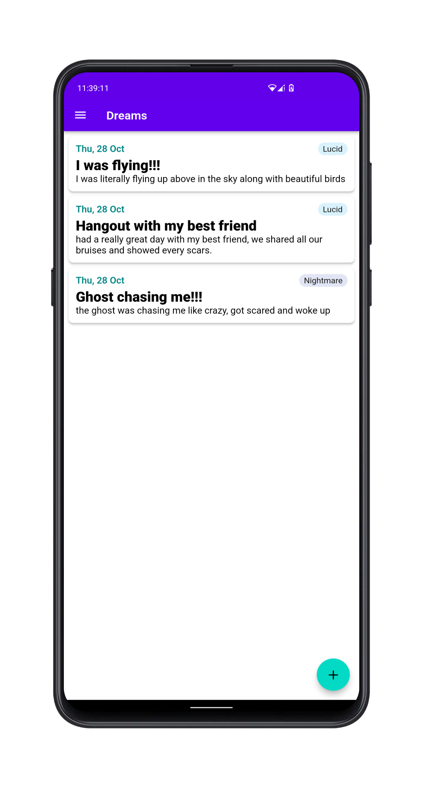
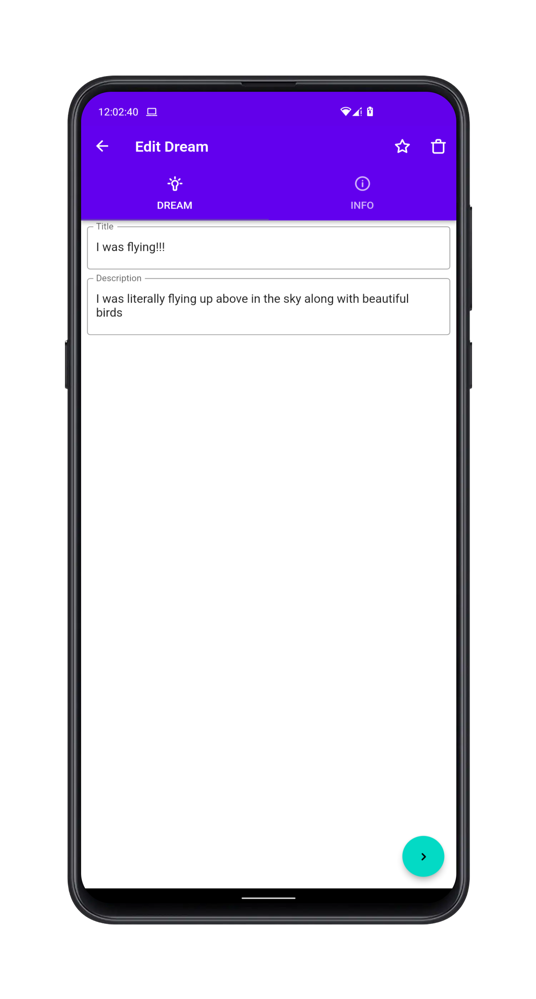
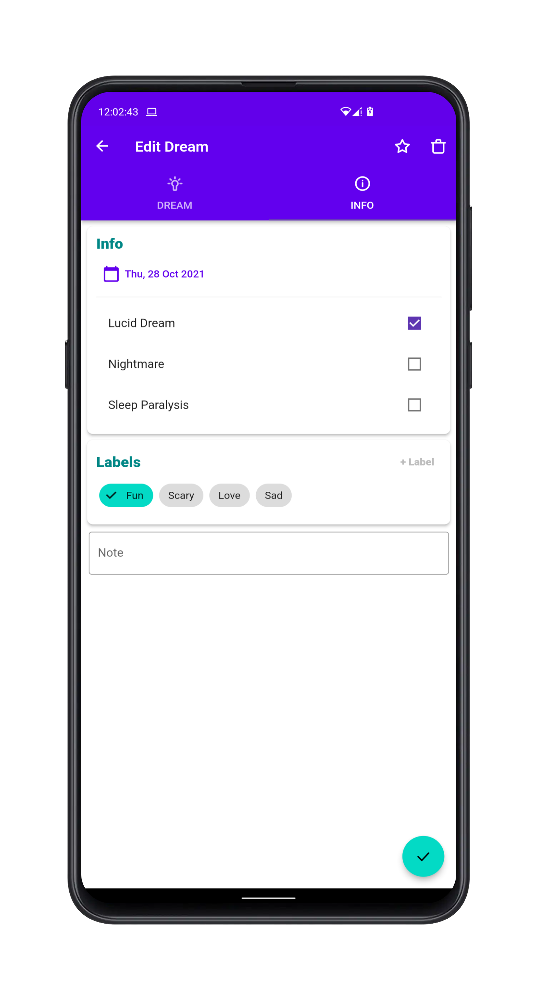
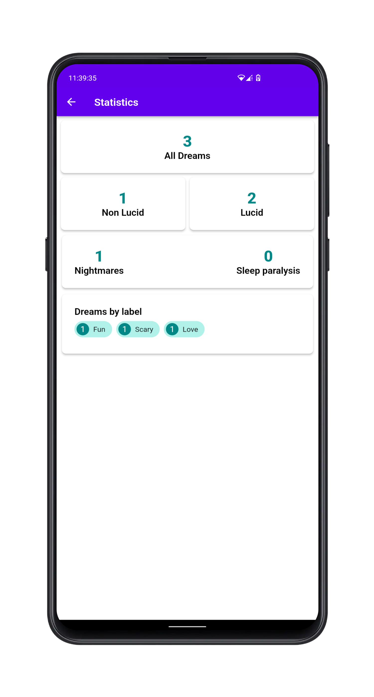
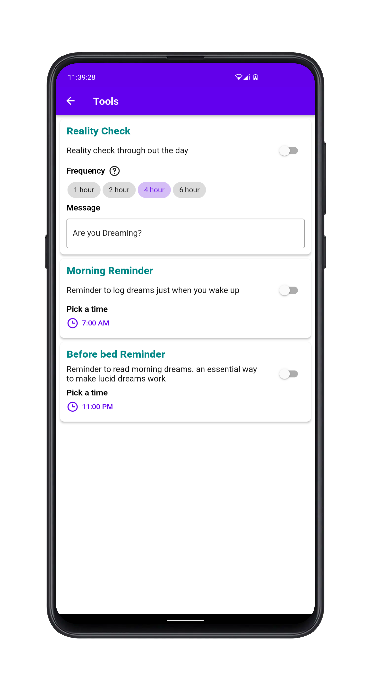
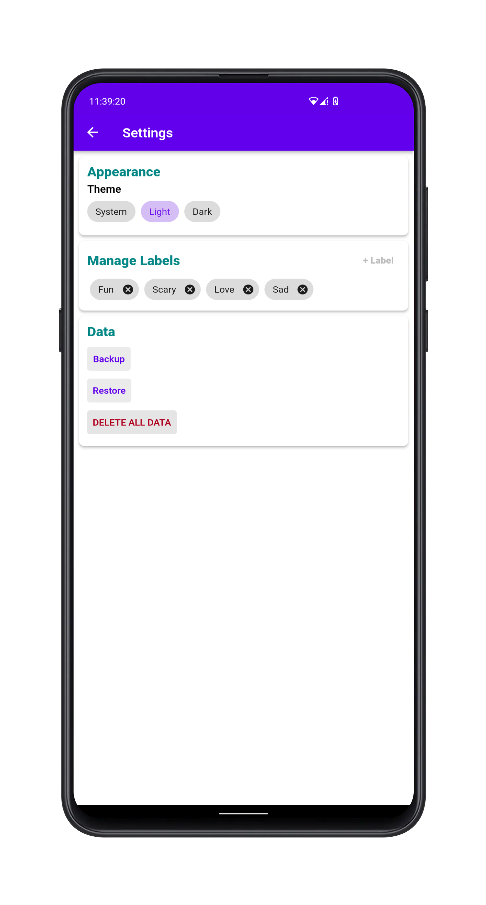

# Lucidy

 

 

A simple app to maintain dream journal in order to achieve lucid dreaming

## Screenshots

## Contributing

Found any bugs? Have any suggestions or code improvements? [Submit an issue](https://github.com/varadgauthankar/lucidy/issues) or fork and send a [pull request](https://github.com/varadgauthankar/lucidy/pulls) with your changes. All contributions are more than welcome.

## License

This project is licensed under the MIT License - see the [LICENSE](https://choosealicense.com/licenses/mit/) file for details.
